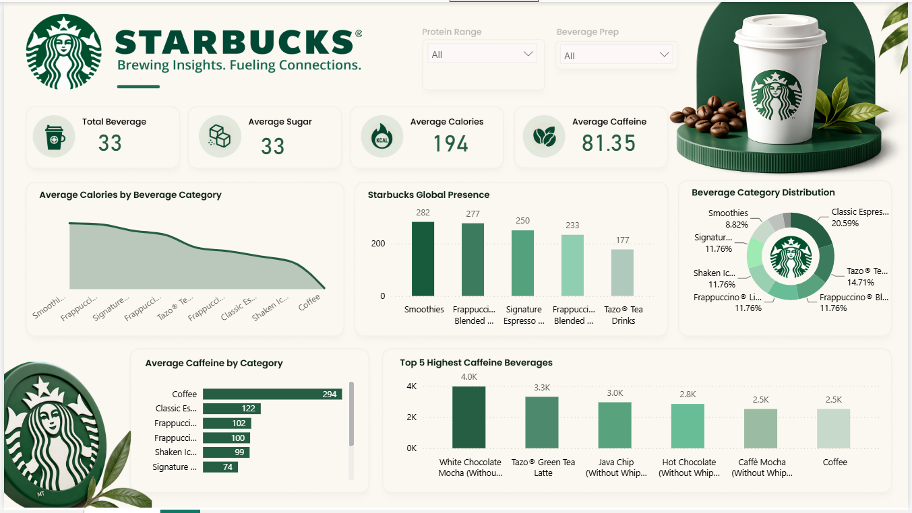

# ☕ Starbucks Sales & Nutrition Analytics Dashboard \| Power BI

> An interactive **Power BI** dashboard that analyzes Starbucks beverage
> nutrition data to uncover product insights, compare beverage
> categories, and visualize nutritional trends through dynamic
> dashboards.

------------------------------------------------------------------------

# 📑 Table of Contents

-   Project Overview
-   Business Problem
-   Dashboard Preview
-   Dashboard Features
-   Dashboard Visualizations
-   Business Insights
-   KPIs
-   Dataset Information
-   Data Cleaning & Transformation
-   DAX Measures
-   Tech Stack
-   Dashboard Design
-   Skills Demonstrated
-   Project Structure
-   Future Improvements
-   Learning Outcomes
-   Author

------------------------------------------------------------------------

# 📌 Project Overview

This project presents an interactive **Power BI Dashboard** built using
Starbucks beverage nutrition data.

The objective of this project is to transform raw nutritional data into
meaningful business insights by analyzing calories, sugar, caffeine,
protein, and other nutrition metrics across Starbucks beverage
categories.

Users can: - Compare beverage categories - Analyze nutrition values -
Identify high-calorie and high-caffeine beverages - Explore interactive
filters for customized analysis

------------------------------------------------------------------------

# 🎯 Business Problem

Starbucks offers a wide range of beverages with different nutritional
compositions.

This dashboard answers questions like:

-   Which beverage categories contain the highest calories?
-   Which beverages have the highest caffeine?
-   How are beverages distributed across categories?
-   Which drinks are healthier?
-   What are the average nutrition values?

------------------------------------------------------------------------

# 📷 Dashboard Preview

## ☕ Main Dashboard

<p align="center">
  
</p>


------------------------------------------------------------------------

# 🚀 Dashboard Features

### KPI Cards

-   Total Beverages
-   Average Sugar
-   Average Calories
-   Average Caffeine

### Interactive Filters

-   Protein Range
-   Beverage Preparation Type

All visuals update dynamically based on user selections.

------------------------------------------------------------------------

# 📊 Dashboard Visualizations

## 📈 Average Calories by Beverage Category

<p align="center">
  
</p>

**Purpose**

Displays the average calorie content across beverage categories.

**Business Value**

-   Compare calorie levels
-   Identify healthier beverages
-   Analyze calorie trends

------------------------------------------------------------------------

## 📊 Beverage Count by Category

<p align="center">
  
</p>

**Purpose**

Shows the number of beverages available in each category.

**Business Value**

-   Compare category sizes
-   Understand Starbucks product portfolio
-   Identify dominant beverage categories

------------------------------------------------------------------------

## 🍩 Beverage Category Distribution

<p align="center">
  
</p>

**Purpose**

Illustrates the percentage distribution of beverage categories.

------------------------------------------------------------------------

## ☕ Average Caffeine by Beverage Category

<p align="center">
  
</p>

**Purpose**

Ranks beverage categories based on average caffeine content.

------------------------------------------------------------------------

## 🔥 Top 5 Highest Caffeine Beverages

<p align="center">
  
</p>

**Purpose**

Highlights the five beverages with the highest caffeine content.

------------------------------------------------------------------------

# 📈 Business Insights

-   Coffee beverages contain the highest average caffeine.
-   Smoothies and blended beverages generally contain higher calories.
-   Beverage categories have significantly different nutritional
    profiles.
-   High-sugar beverages are often associated with higher calorie
    counts.
-   Interactive slicers enable flexible nutrition analysis.

------------------------------------------------------------------------

# 📊 Key Performance Indicators (KPIs)

  KPI                Description
  ------------------ ---------------------------
  Total Beverages    Total beverages available
  Average Sugar      Average sugar (g)
  Average Calories   Average calorie value
  Average Caffeine   Average caffeine (mg)

------------------------------------------------------------------------

# 📂 Dataset Information

Dataset includes:

-   Beverage
-   Beverage Category
-   Beverage Preparation
-   Calories
-   Sugars (g)
-   Protein (g)
-   Caffeine (mg)
-   Sodium (mg)
-   Cholesterol (mg)
-   Dietary Fibre (g)
-   Saturated Fat (g)
-   Calcium (%DV)
-   Iron (%DV)

------------------------------------------------------------------------

# 🧹 Data Cleaning & Transformation

Performed using **Power Query**.

Cleaning steps:

-   Removed duplicate records
-   Handled missing values
-   Corrected data types
-   Standardized category names
-   Created calculated columns
-   Prepared data for visualization

------------------------------------------------------------------------

# 📈 DAX Measures Used

``` dax
Total Beverages =
COUNT(starbucks[Beverage])

Average Calories =
AVERAGE(starbucks[Calories])

Average Sugar =
AVERAGE(starbucks[Sugars_g])

Average Caffeine =
AVERAGE(starbucks[Caffeine_mg])
```

Additional DAX calculations were used for KPI cards, category
aggregations, and interactive reporting.

------------------------------------------------------------------------

# 🛠 Tech Stack

-   Microsoft Power BI Desktop
-   Power Query
-   DAX
-   Data Modeling
-   Data Visualization

------------------------------------------------------------------------

# 🎨 Dashboard Design

-   Starbucks-inspired green theme
-   KPI cards
-   Interactive slicers
-   Clean business layout
-   Responsive visual design

------------------------------------------------------------------------

# 📌 Skills Demonstrated

-   Data Cleaning
-   Power Query
-   DAX
-   Data Modeling
-   Dashboard Design
-   Data Visualization
-   Business Intelligence
-   KPI Development
-   Interactive Reporting

------------------------------------------------------------------------

# 📁 Project Structure

``` text
Sales-Nutrition-Analytics-Dashboard/
│
├── Dashboard.png
├── Avg Cal by BevgCatg.png
├── Avg Caffin by BevgCatg.png
├── Beverage Catg.png
├── Global Presence.png
├── Highest Caffine Bevg.png
├── Starbucks Sales.pbix
├── Dataset/
│   └── starbucks.csv
├── README.md
└── LICENSE
```

------------------------------------------------------------------------

# 📈 Future Improvements

-   Revenue & Profit Analysis
-   Sales Trend Analysis
-   Seasonal Analysis
-   Customer Segmentation
-   Mobile Layout
-   Drill-through Reports
-   AI-powered Insights
-   Forecasting

------------------------------------------------------------------------

# 💡 Learning Outcomes

This project strengthened my skills in:

-   End-to-end Power BI dashboard development
-   Data Cleaning
-   Data Modeling
-   DAX
-   Business Intelligence
-   Interactive Reporting
-   Data Storytelling

------------------------------------------------------------------------

# 👨‍💻 Author

**Aritra Banerjee**

Final Year B.Tech (Electronics & Computer Science Engineering)

**Aspiring Data Analyst \| Power BI Developer \| Python Developer \|
Machine Learning Enthusiast**

### 📬 Connect with Me

-   💼 LinkedIn: [*(LinkedIn)*](https://www.linkedin.com/in/aritra-banerjee-/)
-   💻 GitHub: [*(GitHub)*](https://github.com/AritraBanerjee-09)

------------------------------------------------------------------------

## ⭐ Support

If you found this project useful, please consider giving this repository
a ⭐ on GitHub.

------------------------------------------------------------------------

## 📄 License

This project is intended for educational and portfolio purposes.
